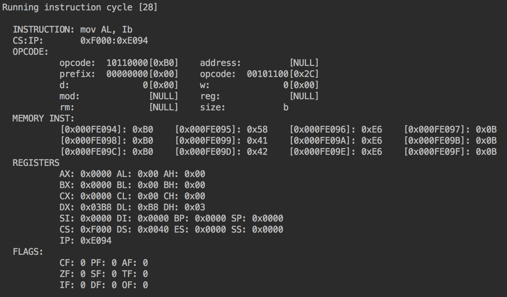

# js86emu


[](https://circleci.com/gh/crempp/js86emu)

js86emu is an x86 emulator written entirely in Javascript. The current goal is to correctly
emulate an 8086(88) processor along with auxiliary hardware such as hard disk
controllers and graphics. This will allow emulation of original PC XT and PC AT systems. I plan on adding support for newer processors and
systems until it speed becomes a significant issue.

<p align="center">
  
</p>

Demo : [http://js86emu.chadrempp.com](http://js86emu.chadrempp.com)

Current Progress

* Support for all documented 8086 instructions and addressing modes
* Functioning stack
* Basic debugging logging
* 80x25 MDA text mode graphics using code page 437 font set
* Video renderer support for canvas, PNG and binary output
* 80% or better test coverage

## Usage

There are two ways to run js86emu: a command line client or as a web application.

First build the entire package

```
$ npm run build
```

### Command Line Client

The command line client is run as an NPM command and is very basic at the
moment.

Currently only the PNG renderer is supported with the command line client and
screen renders will be stored in the `./screenOut` directory. This happens at
the screen refresh rate (~50hz) and could easily generate thousands of images
so be careful.

```
$ npm run run:cli
```

### Web Application

The web application uses a node webserver to serve the web build of the
emulator and by default renders to canvas.

```
$ npm run run:web
```

Then access the application at [http://localhost:8080](http://localhost:8080)

### Docker

Docker is supported.

```
$ docker build -t "js86emu" .
$ 
```

Or use a prebuilt image on Dockerhub

```
$ docker run -p 8080:8080 lapinlabs/js86emu
```

### Testing

js86emu has very good test coverage.

```
$ npm test
```

### Profiling performance

To profile the performance of js86emu the built-in node profiler works quite
well.

```
node --prof ./dist/runner.js
node --prof-process isolate-0x102801e00-v8.log
```

## Documentation

### js86emu
* [References](docs/references.md) - Throughout the code are references to
documentation those are are located here. Also, any helpful references used
during the development of js86emu are listed here.
* [Roadmap](docs/roadmap.md) - Roadmap and general TODO items.

### x86 Architecture
* [Addressing](docs/x86/addressing.md)
* [Flags](docs/x86/flags.md)

# License

[MIT](LICENSE.md)
